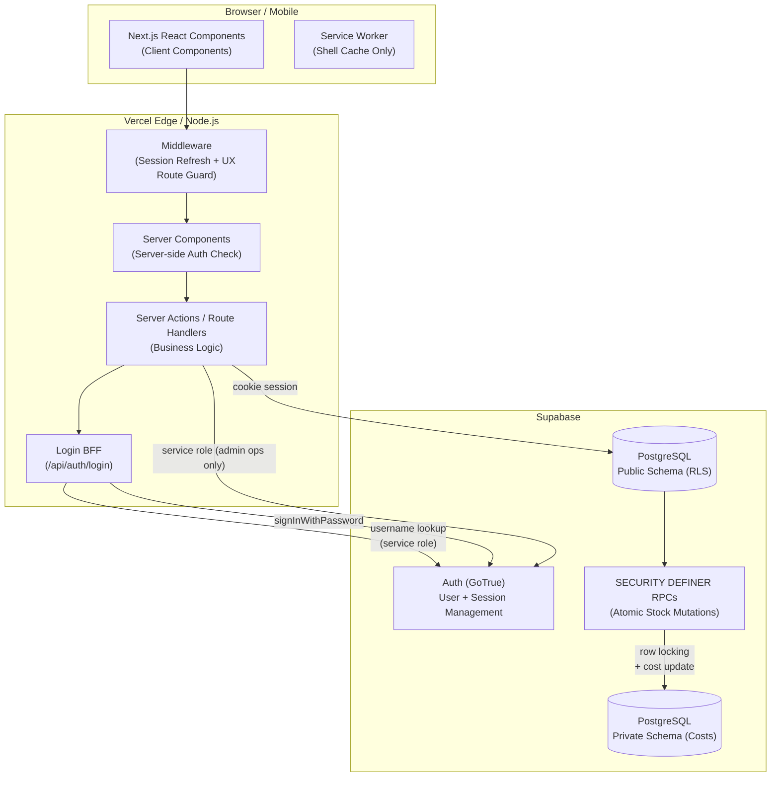
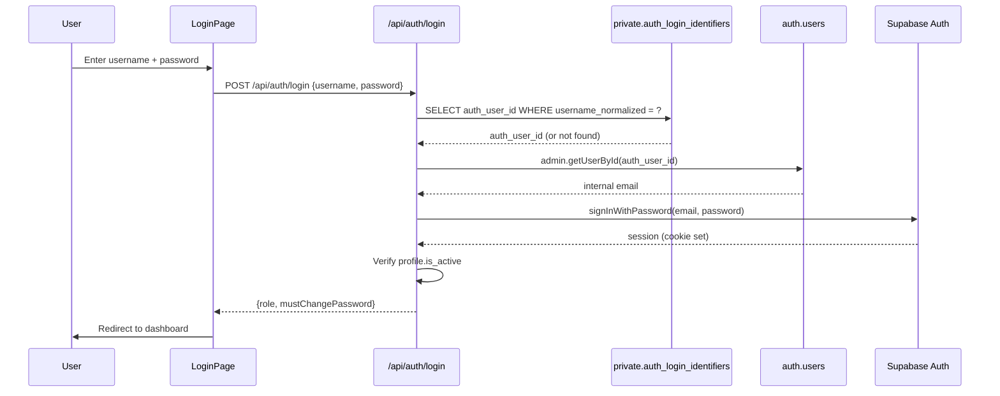
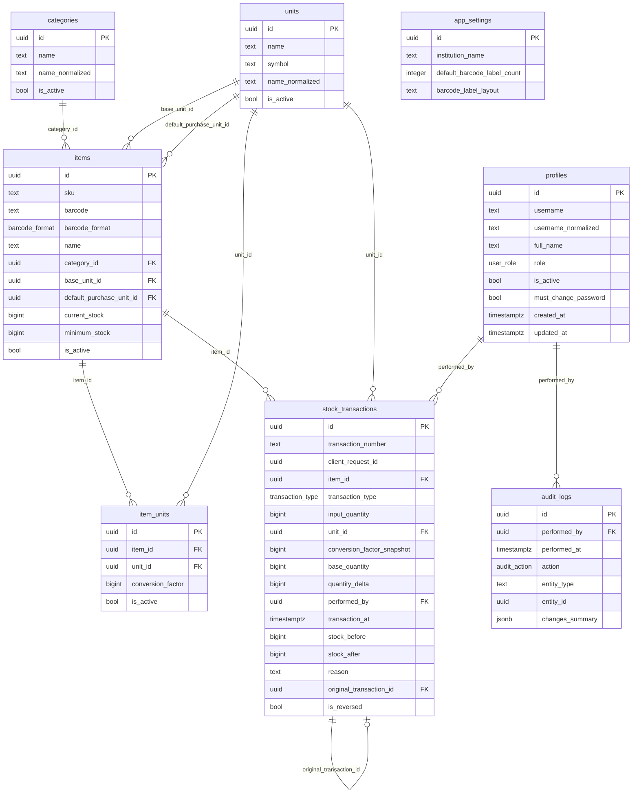

# Arsitektur — InventarisBarang

## Diagram Arsitektur



## Authentication Flow



## Database Schema (ERD)



## Security Architecture

### Defense in Depth

| Layer | Mekanisme |
|---|---|
| UI | Sembunyikan menu admin dari pegawai |
| Middleware | Route guard berdasarkan session |
| Server Components | Verifikasi role + is_active via DB query |
| Server Actions / API | Validasi session + role sebelum operasi |
| RPC Functions | is_admin() check di dalam function body |
| RLS Policies | Policy per role per tabel |
| Schema | Private schema tidak diekspos via Data API |
| Database Constraints | CHECK, UNIQUE, FK, NOT NULL |

### Price Data Isolation

```
Employee Browser ─────────────────────────────────────────
       │                                                  │
       │ (no price data in any response)                 │
       ▼                                                  │
 public.items          ← No price columns               │
 public.stock_transactions ← No price columns           │
 employee_items_view   ← security_invoker, no price     │
 process_stock_out()   ← Uses private cost internally   │
                                                          │
Admin Browser ────────────────────────────────────────────
       │                                                  │
       │ (admin sees price data via admin-only RPCs)     │
       ▼                                                  │
 private.item_costs         ← NOT in Data API           │
 private.stock_transaction_costs ← NOT in Data API      │
```
